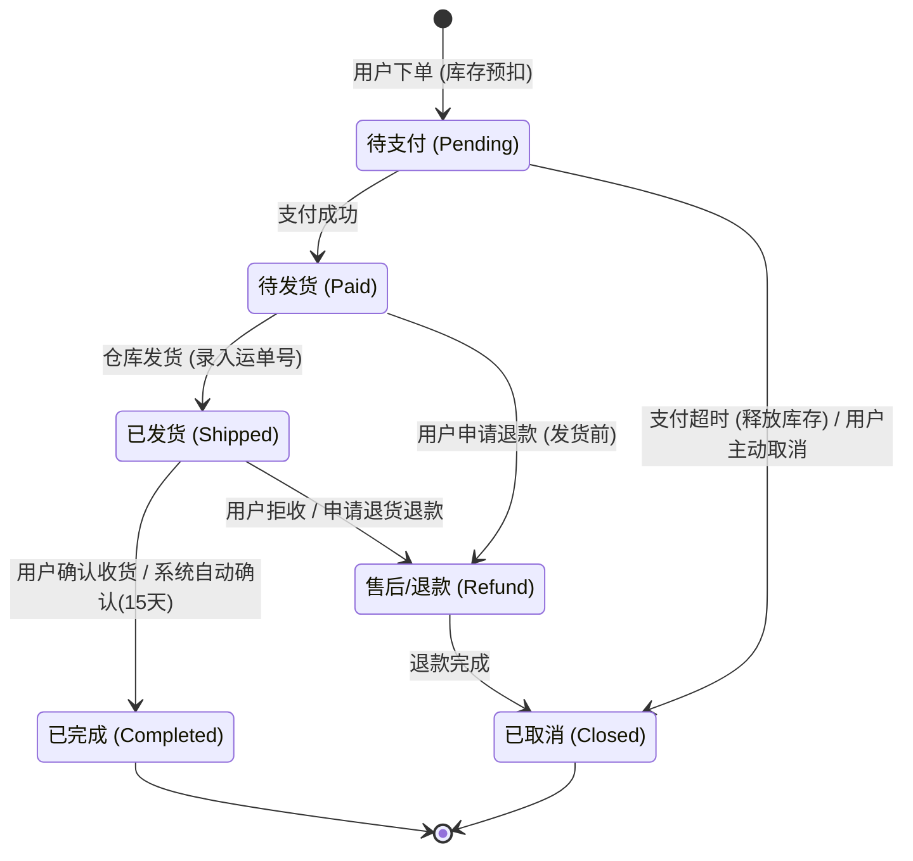
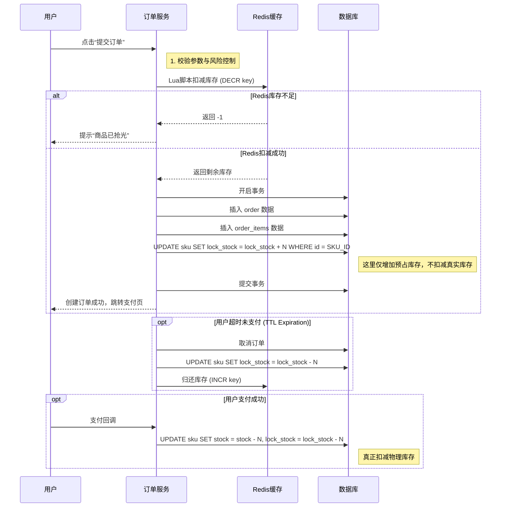

Data table structure design
=====

这是一份针对电商核心业务的**深度技术设计文档**。重点聚焦在最复杂的“商品SKU体系”和“订单状态机”的数据库设计与逻辑流转上。

您可以将以下内容作为技术详细设计（Technical Design Document）的一部分。

-----

# 电商核心系统详细设计 v1.0

## 一、 核心数据库架构设计 (Database Schema)

我们采用经典的**SPU-SKU**分离模型来管理商品，并采用**主子订单**模型来管理交易。

### 1\. 商品中心 (Product Module)

#### `spu` (标准产品单位表)

描述商品的公共属性（如：iPhone 15）。

```sql
CREATE TABLE `spu` (
  `id` bigint(20) unsigned NOT NULL AUTO_INCREMENT,
  `spu_no` varchar(64) NOT NULL COMMENT '商品唯一编码',
  `title` varchar(255) NOT NULL COMMENT '商品标题',
  `category_id` bigint(20) NOT NULL COMMENT '后台类目ID',
  `brand_id` bigint(20) NOT NULL COMMENT '品牌ID',
  `main_images` json DEFAULT NULL COMMENT '主图集合(JSON数组)',
  `detail_html` longtext COMMENT '商品详情(富文本)',
  `publish_status` tinyint(4) DEFAULT '0' COMMENT '状态: 0下架, 1上架',
  `created_at` datetime DEFAULT CURRENT_TIMESTAMP,
  `updated_at` datetime DEFAULT CURRENT_TIMESTAMP ON UPDATE CURRENT_TIMESTAMP,
  PRIMARY KEY (`id`),
  UNIQUE KEY `uk_spu_no` (`spu_no`)
) ENGINE=InnoDB DEFAULT CHARSET=utf8mb4 COMMENT='商品SPU表';
```

#### `sku` (库存量单位表)

描述具体的售卖规格（如：iPhone 15, 黑色, 256G）。**这是下单和库存扣减的最小粒度。**

```sql
CREATE TABLE `sku` (
  `id` bigint(20) unsigned NOT NULL AUTO_INCREMENT,
  `spu_id` bigint(20) NOT NULL COMMENT '关联的SPU ID',
  `sku_no` varchar(64) NOT NULL COMMENT 'SKU唯一编码',
  `sku_name` varchar(255) NOT NULL COMMENT 'SKU名称(拼接规格)',
  `price` decimal(10,2) NOT NULL COMMENT '销售价',
  `market_price` decimal(10,2) DEFAULT NULL COMMENT '划线价/市场价',
  `stock` int(11) NOT NULL DEFAULT '0' COMMENT '当前可用库存',
  `lock_stock` int(11) NOT NULL DEFAULT '0' COMMENT '预占库存(下单未支付)',
  `specs` json NOT NULL COMMENT '规格属性键值对, 如 {"color": "黑色", "storage": "256G"}',
  PRIMARY KEY (`id`),
  KEY `idx_spu_id` (`spu_id`)
) ENGINE=InnoDB DEFAULT CHARSET=utf8mb4 COMMENT='商品SKU表';
```

### 2\. 订单中心 (Order Module)

#### `orders` (订单主表)

记录订单维度的信息，金额、状态、收货人。

```sql
CREATE TABLE `orders` (
  `id` bigint(20) unsigned NOT NULL AUTO_INCREMENT,
  `order_no` varchar(64) NOT NULL COMMENT '订单号(业务主键)',
  `user_id` bigint(20) NOT NULL COMMENT '用户ID',
  `total_amount` decimal(10,2) NOT NULL COMMENT '商品总金额(原价)',
  `pay_amount` decimal(10,2) NOT NULL COMMENT '实际应付金额(含运费, 扣减优惠)',
  `freight_amount` decimal(10,2) DEFAULT '0.00' COMMENT '运费',
  `promotion_amount` decimal(10,2) DEFAULT '0.00' COMMENT '优惠金额',
  `status` tinyint(4) NOT NULL COMMENT '状态: 10待支付, 20待发货, 30已发货, 40已完成, 50已取消, 60售后中',
  `pay_time` datetime DEFAULT NULL COMMENT '支付时间',
  `delivery_time` datetime DEFAULT NULL COMMENT '发货时间',
  `receiver_json` json NOT NULL COMMENT '收货人信息快照(姓名,电话,地址)',
  `remark` varchar(255) DEFAULT NULL COMMENT '买家留言',
  `is_deleted` tinyint(1) DEFAULT '0' COMMENT '逻辑删除',
  PRIMARY KEY (`id`),
  UNIQUE KEY `uk_order_no` (`order_no`),
  KEY `idx_user_status` (`user_id`,`status`)
) ENGINE=InnoDB DEFAULT CHARSET=utf8mb4 COMMENT='订单主表';
```

#### `order_items` (订单明细表)

**设计关键点**：必须存储下单时的**数据快照**（Snapshot）。即使商品后续改名或改价，历史订单信息不能变。

```sql
CREATE TABLE `order_items` (
  `id` bigint(20) unsigned NOT NULL AUTO_INCREMENT,
  `order_no` varchar(64) NOT NULL COMMENT '关联订单号',
  `spu_id` bigint(20) NOT NULL,
  `sku_id` bigint(20) NOT NULL,
  `spu_name` varchar(255) NOT NULL COMMENT '下单时的商品名称快照',
  `sku_image` varchar(255) DEFAULT NULL COMMENT '下单时的SKU图片',
  `price` decimal(10,2) NOT NULL COMMENT '下单时的单价快照',
  `quantity` int(11) NOT NULL COMMENT '购买数量',
  `total_price` decimal(10,2) NOT NULL COMMENT '行总价 (price * quantity)',
  PRIMARY KEY (`id`),
  KEY `idx_order_no` (`order_no`)
) ENGINE=InnoDB DEFAULT CHARSET=utf8mb4 COMMENT='订单明细表';
```

-----

## 二、 核心业务逻辑图 (Logic Diagrams)

### 1\. 订单状态机流转图 (Order State Machine)

这是电商系统最严谨的部分，任何状态变更都需要记录日志。



### 2\. 库存扣减策略 (Inventory Strategy)

为防止“超卖”（Overselling），建议采用 **Redis + 数据库** 双重扣减机制。

**流程时序图：**



-----

## 三、 关键技术难点设计说明

### 1\. 价格计算引擎

不要在前端计算金额！前端只负责展示，最终金额必须由后端计算。

$$
\text{Final Amount} = \sum (\text{Item Price} \times \text{Qty}) + \text{Freight} - \text{Coupon} - \text{Discount}
$$  * **设计建议**：创建一个独立的 `PriceCalculator` 服务，输入为 `[SKU_ID, Qty, Coupon_ID]`，输出为 `[Total, Discount_Details]`。

### 2\. 购物车数据结构 (Redis Hash)

购物车读写频繁，且不需要永久严格持久化（可异步存库），推荐使用Redis Hash结构。

* **Key**: `cart:{user_id}`
* **Field**: `{sku_id}`
* **Value**: JSON String `{"qty": 2, "add_time": timestamp, "selected": true}`

### 3\. 规格设计 (Spec Management)

如何处理不同商品千奇百怪的规格（如衣服有颜色/尺码，电脑有CPU/内存）？

* **方案 A (EAV模型)**：使用 `attribute_key`, `attribute_value` 表关联。灵活性高，但查询SQL极其复杂，性能差。
* **方案 B (JSON - 推荐)**：如上述 `sku` 表设计，直接将规格存为 JSON 字段。
* 前端读取时直接解析渲染。
* MySQL 5.7+ 支持 JSON 索引，也可以进行简单查询。
* 大大减少连表查询。

-----
