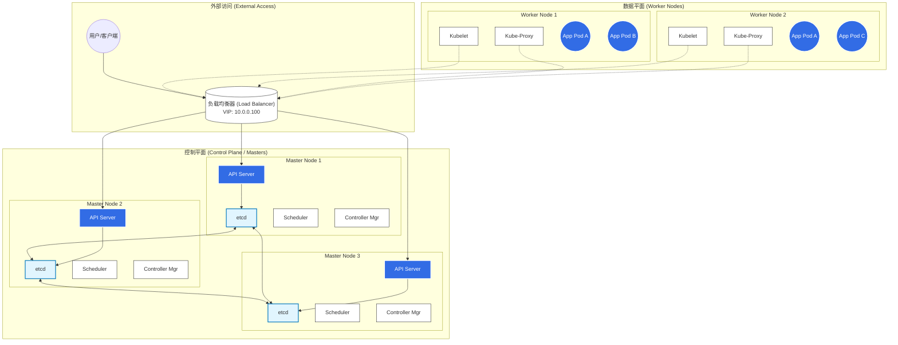
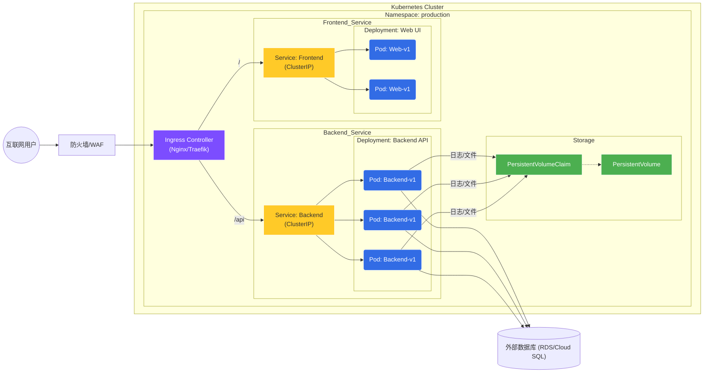

K8s
=====

在 Markdown 文档中绘制架构图，最通用且最强大的方式是使用 **Mermaid.js**。GitHub、GitLab、Obsidian 以及大多数现代 Markdown
编辑器都原生支持它。

以下为您提供两套不同视角的 K8s 部署架构图代码和说明：

1. **基础设施视角 (Infrastructure View)**：展示高可用 (HA) 集群的节点和组件布局。
2. **应用流量视角 (Traffic Flow View)**：展示请求如何从外部通过 Ingress 流向 Pod 和数据库。

-----

### 方案一：K8s 高可用集群架构 (Infrastructure)

这个图展示了一个生产环境级别的 K8s 集群，包含负载均衡器、3个控制平面（Master）节点和多个工作（Worker）节点。

您可以直接复制下面的代码块到您的 Markdown 文件中：

-----

### 方案二：应用部署与流量流向图 (Application View)

这个图更适合开发人员，展示了一个典型的微服务应用是如何部署的，包括 Ingress、Service、Deployment、Pod 以及持久化存储（PVC）。

-----

### 核心组件说明

如果您需要在文档中解释这些架构，可以使用以下描述：

#### 1\. 控制平面 (Control Plane)

* **API Server:** 集群的统一入口，处理 REST 操作并更新 Etcd。
* **Etcd:** 高可用的键值存储，保存集群的所有状态数据。
* **Controller Manager:** 负责维护集群状态（如故障检测、自动扩缩容）。
* **Scheduler:** 负责决定将新建的 Pod 分配到哪个节点上运行。

#### 2\. 工作节点 (Worker Node)

* **Kubelet:** 节点上的代理，负责管理容器的生命周期。
* **Kube-proxy:** 维护网络规则，实现 Service 的负载均衡。
* **Pod:** K8s 的最小调度单元，通常包含一个或多个容器。

#### 3\. 网络与存储 (Network & Storage)

* **Ingress:** 管理外部访问集群内部服务的 HTTP/HTTPS 路由。
* **Service:** 定义一组 Pod 的逻辑集合和访问策略（ClusterIP, NodePort, LoadBalancer）。
* **PVC/PV:** 持久化存储系统，将存储资源与 Pod 解耦。

-----

